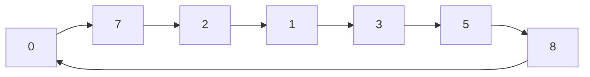
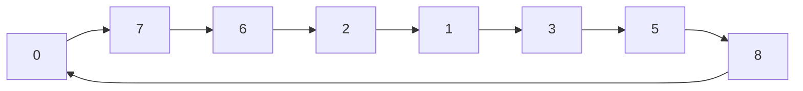
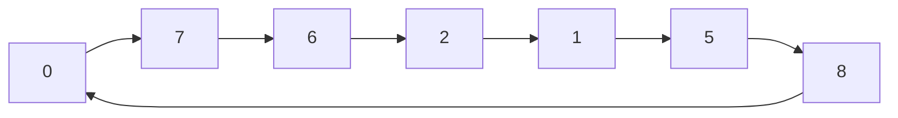

# UT 堆疊，鏈表
---

| 索引  | 內容             | 指示標 |
| --- | -------------- | --- |
| 0   | hotel          | 7   |
| 1   | war memorial   | 3   |
| 2   | museum         | 1   |
| 3   | zoo            | 5   |
| 4   | seafood market | 1   |
| 5   | temple         | 8   |
| 6   |                |     |
| 7   | harbourfront   | 2   |
| 8   | night market   | 0   |
| 9   |                |     |

---
ai) 首7個節點內容：

hotel > harbourfront > museum > war memorial > zoo > temple> night market <!-- element class="fragment" data-fragment-index="1" --> 

aii) 循環鍵表 <!-- element class="fragment" data-fragment-index="2" --> 
<div class="fragment data-fragment-index=1">

</div>
---
而現在題目要你:

```[1-2]
insert(2,"art gallery")
delete(6)
```

<div class="fragment data-fragment-index=1">

</div>
<div class="fragment data-fragment-index=1">

</div>
<div class="fragment data-fragment-index=1">

</div>
---
b) 

| 索引  | 內容             | 指示標 |
| --- | -------------- | --- |
| 0   | hotel          | 7   |
| 1   | war memorial   | 5   |
| 2   | museum         | 1   |
| 3   | zoo            | 5   |
| 4   | seafood market | 1   |
| 5   | temple         | 8   |
| 6   | art gallery    | 2   |
| 7   | harbourfront   | 6   |
| 8   | night market   | 0   |
| 9   |                |     |

---
C)

| 索引  | 內容           | prev | next |
| --- | ------------ | ---- | ---- |
| 0   | hotel        | 8    | 7    |
| 1   | war memorial | 2    | 5    |
| 2   | museum       | 6    | 1    |
| 3   |              |      |      |
| 4   |              |      |      |
| 5   | temple       | 1    | 8    |
| 6   | art gallery  | 7    | 2    |
| 7   | harbourfront | 0    | 6    |
| 8   | night market | 5    | 0    |
| 9   |              |      |      |

---
1d.  

好處：可以從兩個方向存取節點。 

壞處：需要更多記憶體。

---
```[1-4]
push(S,c) #將數字n推入堆疊S
pop(S)#從堆疊S彈出及傳回項目
isNotEmpty(S)#如果S不是空的，傳回TRUE，否則傳回False
```
![[Pasted image 20241211141220.png]]
---
寫出執行以下算法後堆疊S1的內容： 
```
push(S1,30)
push(S1,10)
push(S1,pop(S1)+pop(S1))
push(S1,25)
push(S1,10)
```

![[Pasted image 20241211142627.png]]<!-- element class="fragment" data-fragment-index="1" --> 

---
```
push(S2,30)
push(S2,20)
pop(S2)
如果 isEmpty(S2)則
	push(S2,15)
否則
	push(S2,25)
```

![[Pasted image 20241211142824.png]]<!-- element class="fragment" data-fragment-index="1" --> 

---
```
temp <-- 0
當not isEmpty(S1)
	temp <-- temp + pop(25)
	如果 temp>25 則
		push(S2,25)
		temp <- temp - 25
push(S2, temp)
```

![[Pasted image 20241211143537.png]]<!-- element class="fragment" data-fragment-index="1" --> 

---
c. 
```[1-3]
子程式reverse(A,B)
當not isEmpty(S1)
	push(S2,pop(S1))
```

---
d. 
```[1-4]
reverse(S1,S2)
設 K 由 1 至 N
	pop(S2,K)
reverse(S2,S1)
```

---
e. 

![[F5-6 UT 鏈表堆疊.png]]

[[F5-6 UT 鏈表堆疊.pdf#page=5&rect=40,120,278,257|F5-6 UT 鏈表堆疊, p.5]]
```
定義堆疊 S3
設i由 t 下至 n
	​push (S2, pop(S1))
設i由1至k
	​push (S3, pop(S2))
reverse (S2,S1)
reverse (S3,S2)
```