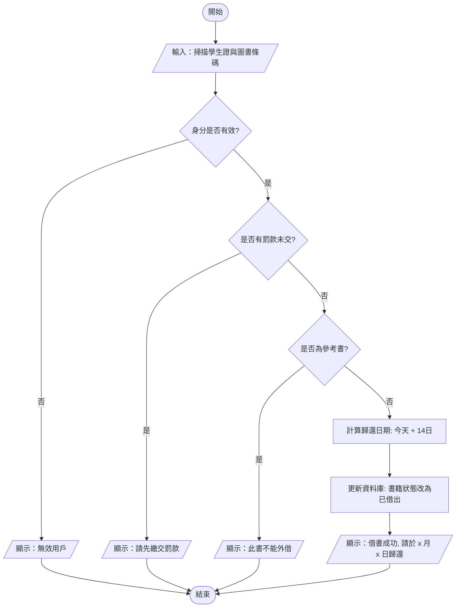

# 📚 圖書館借書系統：完整 IPO 與流程圖設計 (教師參考版)

這份文件為您展示了如何將複雜的「圖書館借書系統」從宏觀的 IPO 分析，具體化到微觀的流程圖邏輯。這也是您在課堂上可以用來跟學生分享的「標準答案」。

---

## 一、 IPO 週期分析 (Input-Process-Output)

| 階段 | 項目 | 具體數據 / 操作 |
| :--- | :--- | :--- |
| **輸入 (Input)** | 用戶數據 | 學生證 ID、用戶密碼 (如需要) |
| | 圖書數據 | 圖書條碼 (Barcode)、書籍類型 (如：參考書/流通書) |
| | 系統數據 | 當前日期、用戶已借書數量、罰款餘額 |
| **處理 (Process)** | 身份驗證 | 1. 檢查學生證是否有效/過期   2. **判斷** 罰款餘額是否為 $0 |
| | 書籍驗證 | 3. **判斷** 書籍是否為「限館內參閱」   4. 檢查書籍是否已被他人預約 |
| | 邏輯運算 | 5. 計算歸還日期 (當前日期 + 14天)   6. 更新資料庫 (用戶借書量 +1, 書籍狀態設為「已借出」) |
| **輸出 (Output)** | 屏幕顯示 | 借書成功/失敗提示、歸還日期、錯誤原因 (如：請先繳交罰款) |
| | 實體/電子憑據 | 列印借書收據、發送確認電郵 |

---

## 二、 系統邏輯流程圖 (Flowchart)

這是一個標準的流程圖邏輯，展示了系統在「處理」階段是如何進行「判斷」的。

---

## 三、 教師教學建議 (如何解釋這張圖)

1.  **IPO 的連續性**：
    告訴學生，IPO 不是孤立的。Input 的數據（如罰款金額）會直接影響 Process 中的「判斷」。

2.  **為什麼要「拆解」？**
    您在示範時可以說：「如果我不拆解，我直接寫程式，我可能會漏掉『參考書不能借』這個判斷。但我畫了流程圖後，邏輯就一目了然了。」

3.  **流程圖與編程的關係**：
    *   **橢圓形 (Start/End)**：像 Micro:bit 的 `on start`。
    *   **菱形 (Decision)**：像 Micro:bit 的 `if ... then ... else`。
    *   **長方形 (Process)**：像 Micro:bit 的 `set variable to ...`。

這份完整的邏輯圖對於您在課堂最後的「承上啟下」環節非常有用！
