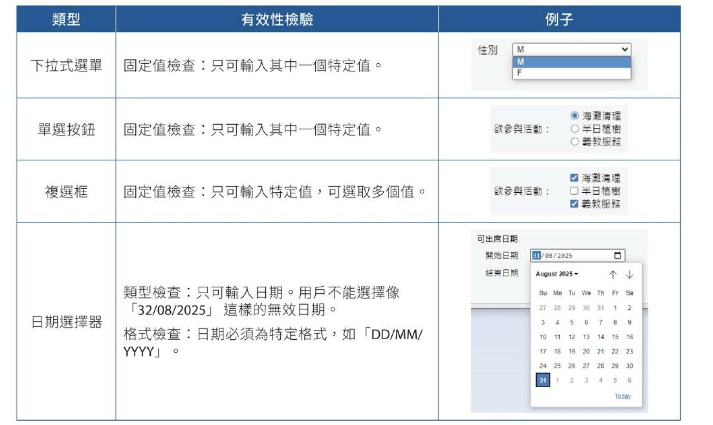
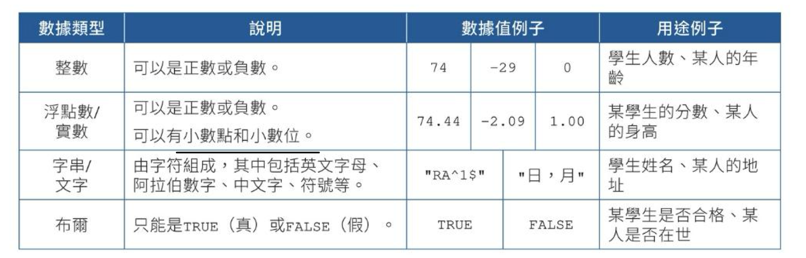
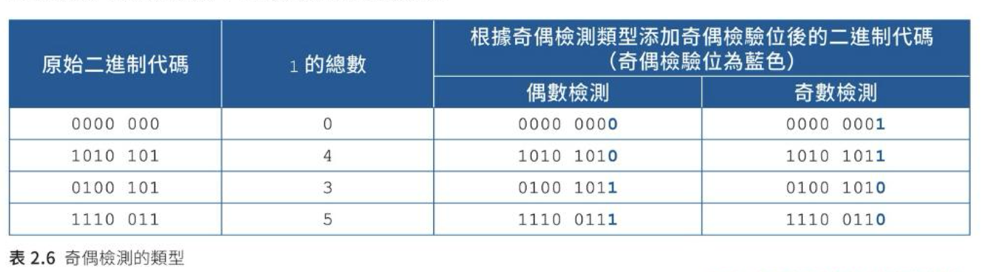

# 第二課：數據控制及數據組織
## 資訊處理入門

---

# 第二課學習目標

學習本課後，大家將能夠：
-   **辨別數據分級中的不同層級**
-   **瞭解「無用輸入，無用輸出」(GIGO) 的概念及數據控制的重要性**
-   **解釋及應用各種數據有效性檢驗及數據驗證**
-   **描述數據庫的功能，包括組織、儲存及提取**
-   **比較順序存取及直接存取兩種檔案存取方法**

---

# 2.1 數據分級 (Data Hierarchy)

-   數據通常以**分級形式儲存**。
-   在數據分級中，每個較高層的數據都是較低層數據的集合。
-   這種層級結構有助於我們有效地組織和管理大量數據。

---

## 數據分級的層級解析

| 層級        | 說明|
| ----------- | -------------------------------------------------------------------------------------------------------------------------------------------------------------------------------------------------------------------------- |
| **欄 (field)** | 指儲存實體的特定屬性，例如學生的姓名。一個欄位可以儲存**任何類型的數據**，如數字或文本。                                                                                                                                      |
| **記錄/列 (record)** | **集合了某實體所有欄位**的組合，例如一位學生的所有資料，包括其 ID、姓名、性別、班級和學號。                                                                                                                                   |
| **檔案/數據表 (file/table)** | **集合了結構相同的記錄**的組合，例如一個儲存了100名學生資料的數據表。                                                                                                                                         |
| **數據庫 (database)** | 相關檔案的集合,**學校數據庫例子包含：** - 儲存學生資料的數據表 - 儲存教師資料的數據表 - 儲存教室資料的數據表  |
<!-- 例如，一個學校的數據庫可能包含多個數據表，如學生資料表、教師資料表、課室資料表及課程時間表資料表。在處理大量數據時，數據庫管理系統 (DBMS) 是更有效的選擇，它能讓我們以圖形用戶界面 (GUI) 有效地組織、儲存和提取數據。 -->
---

在管理大量數據時，**數據庫**通常會是比**試算表**更好的選擇。**數據庫管理系統（DBMS）**使我們能通過**圖形用戶界面（GUI）**有效地組織、儲存和提取數據。

---

# 2.2 數據控制 (Data Control)

## 無用輸入，無用輸出 (Garbage In, Garbage Out - GIGO)
-   數據輸入的方式多樣，包括人手輸入、網絡傳輸、掃描等。
-   然而，在輸入數據的過程中，**錯誤是可能發生的**。
  
---

# 數據錯誤類型

## 常見的三種錯誤類型

1. 數據來源錯誤
2. 轉錄錯誤  
3. 換位錯誤

---

# 數據來源錯誤

## 說明
數據來源提供了不正確的數據。

## 例子
用戶錯誤地提供了一個不存在的電子郵件地址。

## 解決方法
向用戶提供的電子郵件地址發送認證碼，然後要求用戶輸入該碼。

---

# 轉錄錯誤

**說明**
數據被誤讀、誤聽或誤植。 
**例子**
• 光符識別（Optical Character Recognition，簡稱OCR）程式將大楷字母「I」誤讀為小楷字母「l」或數字「1」
• 打字員將「冶」打錯為「治」 
**解決方法**
• 通過檢查單詞的拼寫來檢驗數據的有效性
• 要求用戶再次輸入數據來驗證數據
• 校對數據

---

# 換位錯誤

**說明**
數據位置不正確。

**例子**
• 蘋果的價格被儲存為西瓜的價格
• 某人於記錄一項交易時誤將兩個相鄰數字調轉，令「$15」變成「$51」

**解決方法**
• 通過檢查單詞的拼寫來檢驗數據的有效性
• 要求用戶再次輸入數據來驗證數據
• 校對數據

---

## 無用輸入，無用輸出 (Garbage In, Garbage Out - GIGO)

-   這是一個重要的概念：當**不可靠或不協調的數據**被輸入到數據分析中時，我們便**不能得出有用的、有意義的結果**。
-   這種情況正是我們所稱的「**無用輸入，無用輸出 (GIGO)**」。
-   因此，為確保輸入數據的**有效性和準確性**，我們必須對數據實施嚴格的**控制**。

---

## 數據控制的兩種主要方式

為了確保數據的品質，我們有兩種主要的數據控制方式：

1.  **數據有效性檢驗 (Data Validation)**：
    -   這是**由電腦進行**的檢查。
    -   旨在確保輸入的數據**符合預設的規則和格式**，例如檢查數據類型、範圍等。
2.  **數據驗證 (Data Verification)**：
    -   這是一個**由人手進行**的過程。
    -   目的在於**確認輸入的數據與原始數據保持一致和準確**，通常涉及人工核對或重複輸入。

---

為什麼要數據控制？

---

## 數據有效性檢驗 (Data Validation) 詳解

-   數據有效性檢驗是數據控制的**重要環節**。
-   它雖然不能保證數據的絕對準確，但卻能**確保數據符合既定的規則**。
-   這類檢驗廣泛應用於各種系統，例如政府的預約服務和網上購物平台。

---

### 常見的數據有效性檢驗類型

| 類型           | 功能說明                                           | 例子                                                                        |
| -------------- | -------------------------------------------------- | -------------------------------------------------------------------------- |
| **完整性檢查**   | 確保所有必須填寫的欄位都有數據           | 申請人必須提供姓名                                                   |
| **固定值檢查**   | 確保數據只能從一系列特定的值中選取       | 申請人的性別必須是「M」或「F」                                       |
| **類型檢查**     | 確保數據必須是特定的數據類型 (例如數字、文本) | 申請人的年齡必須是數字                                               |
| **範圍檢查**     | 確保數據必須位於一個指定範圍內           | 申請人的年齡必須大於 12 歲                                           |
| **長度檢查**     | 確保數據的字數符合規定長度             | 申請人必須提供 8 個位的電話號碼                                     |

---

| 類型           | 功能說明                                           | 例子                                                                        |
| -------------- | -------------------------------------------------- | -------------------------------------------------------------------------- |
| **格式檢查**     | 確保數據採用特定的格式                 | 申請人的電郵地址必須包含「@」符號                                   |
| **一致性檢查**   | 確保數據與其他相關欄位之間沒有不合理之處 | 申請人提供的結束日期必須在開始日期之後                               |
| **唯一性檢查**   | 確保該欄位的數據是獨一無二的             | 由於每位學生只能申請一次，申請人中的學生 ID 不應重複                 |
| **檢查數位**     | 透過特定的演算法對數字數據進行檢驗，以確保其有效性 | 香港身份證號碼 (HKID) 和國際標準書號 (ISBN) 的檢查數位           |
| **奇偶檢測**     | 在二進制代碼末尾附加一個檢查位，確保1的總數為偶數或奇數 | 通常用於數據傳輸過程中，檢測數據在傳輸時是否發生錯誤             |

---

系統會用不同用戶界面（如下拉式選單和日期選擇器）-> 取代文字方塊，有效性檢驗更容易

---
# 類型檢查

為方便組織和分析數據，同一欄位的數據應屬同一數據類型。以下為常用於數據欄位的數據類型：

---
# 檢查數位
檢查數位是一種數據有效性檢驗方式，常用於數字數據，例如身份
證號碼、書號、信用卡號碼等。
檢查數位由特定算法生成，並附加到數據的結尾。檢查數位可以有多於一個數位。

如果某項數字數據的檢查數位與算法生成的檢查數位不匹配，則該數據無效。

---

# 奇偶檢測

數據以二進制代碼的形式儲存在電腦中，它們僅由 0 和 1 組成。
為了檢測出數據傳輸過程中的錯誤，我們可以在二進制代碼的末尾
附加一個類似檢查數位的奇偶檢驗位，以確保代碼中 1 的總數是偶數
或奇數。這就稱為奇偶檢測。
- 奇偶檢測可分為兩類：奇數檢測和偶數檢測。
- 

---

## 數據驗證 (Data Verification) 詳解

-   數據驗證是**人手進行**的數據控制部分。
-   其核心作用是**協助確認數據在不同媒體之間傳輸時的準確性和一致性**。

---

### 常見的數據驗證類型

| 類型           | 說明                                                                                               | 例子                                                              |
| -------------- | -------------------------------------------------------------------------------------------------- | ----------------------------------------------------------------- |
| **輸入兩次**   | 操作員需**輸入相同的數據兩次**，系統會比較這兩份複本，以檢查它們是否相同。                  | 用戶在設置新密碼時，通常需要輸入兩次相同的密碼以供確認。           |
| **雙重數據輸入** | **由兩位不同的操作員分別輸入相同的數據**。隨後，系統會比較這兩份輸入，以確保數據的一致性。 | 將紙本問卷的數據分別由兩名操作員輸入電子表單。                       |
| **校對數據**   | **將輸入的數據與原始數據檔案進行比較**，以確認數據是否準確。                                | 將學生的考試成績從紙本試卷輸入電腦後，打印出來並與原始試卷核對。 |

---

# 2.3 數據庫的功能 (Database Functions)

-   數據庫的核心在於其**結構化的組織方式**。
-   良好的數據庫結構能使**不同數據表之間的數據傳遞更流暢**，並能有效**減少數據重複**。
-   為了確保數據的一致性和分析的便捷性，我們在設計數據庫時需**明智地選擇每個欄位的數據類型**。

---

## 數據庫的主要功能概述

數據庫的主要功能旨在高效地管理資訊。

1.  **組織 (Organization)**：
    -   這是指以**特定方式管理和分類收集到的操作數據**，以便日後處理。
    -   常見方法包括：**數據排列、數據有效性檢驗**，以及**數據類型轉換**。
    -   選擇適當的數據結構和數據類型是組織的關鍵。
---
## 數據庫的主要功能概述
2.  **儲存 (Storage)**：
    -   數據在經過組織處理後，會被**長期儲存起來**，以便隨時檢索。
    -   數據可以儲存為**實體副本**，或儲存在**數碼儲存器**中，例如硬碟或USB快閃記憶體。
    -   透過**結構化查詢語言 (SQL)** 或**圖形用戶界面 (GUI)**，我們可以方便地在數據庫中**插入、更改或刪除記錄**。

---
## 數據庫的主要功能概述
3.  **提取 (Retrieval)**：
    -   這是指從數據庫中**檢索和讀取特定數據**的過程。
    -   同樣，**SQL** 或 **GUI** 允許我們根據特定條件從數據庫中**提取所需數據**。
    -   建立**索引**是加快數據提取效率的重要方法。

---

## 數據庫索引 (Index)

-   當我們需要從數據庫中**搜尋特定記錄**（例如學生的姓名）時，數據庫管理系統通常需要**逐行讀取整個數據表**。
-   在數據量龐大的情況下，這會是一個**非常耗時的過程**。
-   **索引** 的作用就像書本的目錄，它是一種**特殊數據結構**，能根據特定欄位（例如學生姓名或ID）來**快速定位數據記錄**，從而顯著**加快數據提取的速度**。

---

### 索引的維護

-   **更新索引**：當數據庫中的記錄發生變化時（例如學生姓名被更改），或者有新的記錄加入時，**索引也需要相應地更新**。
-   **索引的代價**：雖然索引能提高查詢效率，但建立過多的索引會**佔用額外的儲存空間**，並且在更新數據時會**增加系統的開銷**。因此，建立索引需要權衡利弊。

---

# 2.4 檔案存取方式 (File Access Methods)

-   數據可以儲存在不同的儲存設備中。
-   這些儲存設備**決定了數據被存取的方式**。
-   檔案存取方式主要分為兩種：**順序存取 (Sequential Access)** 和 **直接存取 (Direct Access)**。

---

## 順序存取 (Sequential Access)

-   **定義**：使用順序存取的儲存設備會**按照數據寫入的順序從頭開始讀取數據**。
-   如果我們需要存取特定數據，電腦系統必須**從頭開始，依次搜索**直到找到目標數據。
-   **存取速度**：其數據存取速度**難以預測，通常較慢**。
-   **典型設備**：最典型的例子是**磁帶**，常用於數據備份。

---

## 直接存取 (Direct Access)

-   **定義**：使用直接存取的儲存設備，數據可以被**直接寫入或讀取到任何儲存位置**。
-   每個儲存位置都有一個**獨一無二的位址**，這使得數據可以直接被存取，**無需搜索其他位置**。
-   **存取速度**：其數據存取速度**穩定且通常較快**。
-   **典型設備**：硬碟、固態硬碟 (USB 快閃記憶體/隨身碟)、光碟和磁碟等。這些設備常用於儲存**常用數據**。

---

## 順序存取 vs 直接存取：比較一覽

了解兩種存取方式的差異，有助於我們選擇適合不同應用場景的儲存方案。

| 屬性          | 順序存取 (Sequential Access)        | 直接存取 (Direct Access)           |
| ------------- | --------------------------------- | -------------------------------- |
| **存取方式**  | 按順序讀取數據                 | 可直接跳轉到任何位置讀取數據   |
| **數據存取速度** | 難以預測，通常較慢           | 穩定，通常較快                |
| **容量單位價格** | 較低                         | 較高                          |
| **輕便性**    | 較高                         | 較低                          |
| **壽命**      | 較長                         | 較短                          |
| **常見用法**  | 儲存備份、歸檔數據           | 儲存常用數據、作業系統、應用程式 |

---

# 課文總結 (Chapter Summary)

這節課我們學習了數據在資訊系統中的組織、控制和存取方式，這些都是理解資訊科技運作的基礎。

## 數據分級 (Data Hierarchy)
-   數據庫是由層級組成的，從最低到最高依序是：**欄**、**記錄**、**檔案**、**數據庫**。

---

## 數據控制 (Data Control)
-   **數據有效性檢驗 (Data Validation)**：
    -   由**電腦**進行，旨在確保數據符合既定規則。
    -   包括：**完整性檢查、固定值檢查、類型檢查、範圍檢查、長度檢查、格式檢查、一致性檢查、唯一性檢查、檢查數位、奇偶檢測**。
-   **數據驗證 (Data Verification)**：
    -   由**人手**進行，旨在確保數據在傳輸過程中保持準確。
    -   包括：**輸入兩次、雙重數據輸入、校對數據**。

---

## 數據庫的功能 (Database Functions)
-   **組織**：根據數據庫結構來組織數據，包括排列、檢驗和轉換數據類型。
-   **儲存**：在數據庫中插入、更改或刪除記錄。
-   **提取**：從數據庫中提取特定數據，並可利用**索引**加快提取速度。

---

## 檔案存取方式 (File Access Methods)
-   **順序存取 (Sequential Access)**：在存取第 N 項元素前，必須先處理前面所有的元素。
-   **直接存取 (Direct Access)**：可以直接存取任何指定的元素，無需處理其前面的元素。

