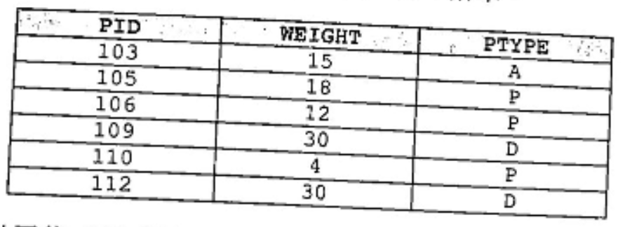
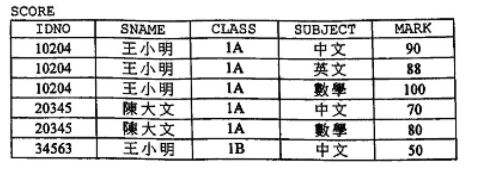

# 中四 ICT 單元 A5 數據庫溫習工作紙

**姓名：** \_\_\_\_\_\_\_\_\_\_ **班別：** \_\_\_\_\_ **( )** **得分：** \_\_\_\_/25


### 第一部分：選擇題 (Multiple Choice) —— 核心概念檢測

1. **(2021 P1A Q4)** 
在數據庫軟件內建構數據庫表時，用戶通常應設定什麼？

    (1) 每個欄的數據類型
    (2) 最多的記錄數目
    (3) 主關鍵碼

    A. 只有 (1) 和 (2)
    B. 只有 (1) 和 (3)
    C. 只有 (2) 和 (3)
    D. (1)、(2) 和 (3)


2. **(2022 P1A Q2)** 
某超級市場使用數據庫表 FRUIT 儲存水果名稱 FNAME 和相應的庫存量 QTY。下列哪項最能描述以下查詢的結果？
    ```sql
    SELECT FNAME FROM FRUIT WHERE QTY > 0 ORDER BY QTY DESC
    ```
    A. 水果按名稱依降序列出
    B. 水果按庫存量依升序列出
    C. 庫存量少的水果按名稱依升序列出
    D. 水果按庫存量依降序列出

---
3. **(2020 P1A Q11)** 某數據庫表 PET 內有 6 筆記錄。執行以下 SQL 語句後的輸出會包括什麼數值？

--
    ```sql
    SELECT SUM(WEIGHT) FROM PET GROUP BY PTYPE
    ```
    *(已知數據庫中 PTYPE A 有 1 筆(15kg)，P 有 3 筆(18, 12, 4kg)，D 有 2 筆(30, 30kg))*
    (1) 109   (2) 15   (3) 34   (4) 60
    A. 只有 (1)
    B. 只有 (2)
    C. 只有 (3) 和 (4)
    D. 只有 (2)、(3) 和 (4)

---

### 第二部分：結構性題目 (Structured Questions) —— 實戰邏輯應用

#### 1. 數據有效性與鍵碼分析 (參考 2021 P1B Q4)
李小姐設計了一個數據庫表 `SCORE`，用於儲存學生的考試分數：


`IDNO` 內的數字是學生編號，其內所有數字的總和必須可被 7 整除（例如 10204：1+0+2+0+4=7）。

(a) 試從以下學生編號中，指出哪一個是有效的？ (1分)
    `46300` 、 `10409` 或 `10205`
<br>**答案：** <u>　　　　　　　　　　　</u>

(b) 舉出 `SCORE` 的主關鍵碼。 (1分)
<br>**答案：** <u>　　　　　　　　　　　</u>

(c) 執行以下 SQL 語句後的輸出是什麼？ (2分)
    ```sql
    SELECT SUBJECT, AVG(MARK) FROM SCORE GROUP BY SUBJECT
    ```
    **答案：**
    
<div class="full-width-box height-150px"></div>

---

#### 2. 輸入遮罩與 SQL 模式匹配 (參考 2025 Sample P1B Q7)
李老師使用數據庫表 `SS` 來儲存學生服務資料：

| CL | CNO | SER | HR |
| :--- | :--- | :--- | :--- |
| 2A | 22 | 賣旗 | 15 |
| 2C | 2 | 圖書館助理 | 40 |
| 2C | 5 | 資訊科技領袖生 | 35 |

(a) 建議對 `CL` (班別) 進行哪種格式檢查（有效性檢驗）最為有效？ (1分)
    **答案：** \_\_\_\_\_\_\_\_\_\_ (例如：輸入遮罩 / 範圍檢查)

(b) 執行以下 SQL 語句後的輸出是什麼？ (1分)
    ```sql
    SELECT CL, CNO FROM SS WHERE SER = '賣旗' AND CL LIKE '2_'
    ```
    **答案：** \_\_\_\_\_\_\_\_\_\_

(c) 若要計算各班 (CL) 服務時數 (HR) 的總和，應如何編寫 SQL？ (2分)
    ```sql
    SELECT CL, __________(HR) FROM SS __________ BY CL
    ```

---

#### 3. 數據完整性與 NULL 處理 (參考 2020 P1B Q1)
在數據庫表 `STUDENT` 中，有些學生缺席測驗。

(a) 若有人建議在 `TEST1` 分數欄位中儲存 'ABS' 或 0 以代表缺席，請各舉出一個缺點。 (2分)
    *   儲存 'ABS' 的缺點：\_\_\_\_\_\_\_\_\_\_ (提示：數據類型不符)
    *   儲存 0 的缺點：\_\_\_\_\_\_\_\_\_\_ (提示：與得到零分的學生混淆)

---

### 🎓 老師的溫習攻略 (Pro-Tips)：

1.  **零 vs NULL：** 同學們必須分辨清楚。`0` 是一個數值，會被納入 `AVG()` 計算；而 `NULL` 代表數據缺失，在統計函數中通常會被忽略。
2.  **主關鍵碼 (Primary Key)：** 選取時必須確保該欄位具有 **唯一性 (Uniqueness)** 且 **不能為空值 (Not NULL)**。
3.  **LIKE 指令：** 萬用字符 `%` 代表任意數量的字符，而 `_` (底線) 代表正好一個字符。
4.  **排序 (ORDER BY)：** 預設是升序 (ASC)，降序必須加上 `DESC`。

這份工作紙結合了最新的 2025 樣本作參考，大家完成後可以對照課文總結中的函數表，確保理解每一個 SQL 關鍵字的運作邏輯。加油！