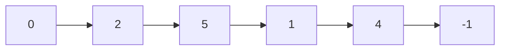
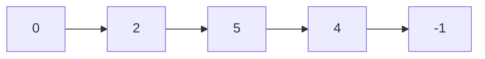
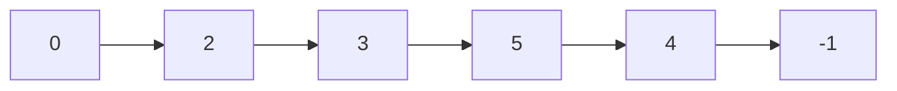

作業CH.5 數據結構-短題目

---
### 鏈表

鏈表由許多個節點形成，而每一個節點都儲存着自身的數據和一個指示標，而該指示標則儲存着下一個節點的位址。指示標連繫着每一個在鏈表中的節點。
![[Pasted image 20241120142249.png]]
---

Q1 鏈表


```[1-2]
add(n, program)  # 在T的第n個節點後加入一個內容為program的節點
del (n) # 刪除T的第n個節點
```

| 位址  | 內容                | 指示標 |
| --- | ----------------- | --- |
| ０   | START             | 2   |
| 1   | Master Chef       | 4   |
| 2   | Daily News Report | 5   |
| 3   |                   |     |
| 4   | Jurassic Park     | -1  |
| 5   | Stock Overview    | 1   |

---


而現在題目要你:

```[1-2]
del(4)
add(2, "Beyblade")
```

<div class="fragment data-fragment-index=1">

</div>
<div class="fragment data-fragment-index=2">

</div> 
<div class="fragment data-fragment-index=3">

</div> 


---
### 1b. 答案： 

| 位址  | 內容                | 指示標 |
| --- | ----------------- | --- |
| ０   | START             | 2   |
| 1   | Master Chef       | 4   |
| 2   | Daily News Report | 3   |
| 3   | Beyblade          | 5   |
| 4   | Jurassic Park     | -1  |
| 5   | Stock Overview    | 4   |

---
### 堆疊

以後進先出法操作的數據結構。

推入操作: 當你將數據加至（推入）一個堆疊內，數據會被加入至堆疊的頂端。

彈出操作: 當你將數據從堆疊取出（彈出），被取出的數據將會是在堆疊頂端的。

![[Pasted image 20241120150540.png]]

---
Q2.  建立了索引 1 至10 的堆疊S

以下子程式操堆疊： 
```[1-4]
push(S,n) #將數字n推入堆疊S
pop(S)#從堆疊S彈出及傳回項目
clear(S)#從堆疊移除所有項目
isNotEmpty(S)#如果S不是空的，傳回TRUE，否則傳回False
```


---
定義了子程式P(N)： 
```[1-5]
子程式 P(N)
	clear(S)
	當 N > 0 
		push(S, N % 2)
		N <- N//2
```

--- 
2a. 寫下子程式P(11)後， 堆疊S 的內容

| S   |     |     |     |     |     |     |     |     |     |     |
| --- | --- | --- | --- | --- | --- | --- | --- | --- | --- | --- |
| 索引  | 1   | 2   | 3   | 4   | 5   | 6   | 7   | 8   | 9   | 10  |
<!-- element class="fragment" data-fragment-index="1" --> 

| S   | 1   | 1   | 0   | 1   |     |     |     |     |     |     |
| --- | --- | --- | --- | --- | --- | --- | --- | --- | --- | --- |
| 索引  | 1   | 2   | 3   | 4   | 5   | 6   | 7   | 8   | 9   | 10  |
<!-- element class="fragment" data-fragment-index="2" --> 

---
2b.  輸出會是什麼？ 
```[1-4]
N <- 11
P(N)
當 isNotEmpty(S)
	輸出pop(S)
```

-  1011<!-- element class="fragment" data-fragment-index="1" --> 
---

2c. 以上算法有什麼目的？ 
- 將十進制數字變成二進制數字<!-- element class="fragment" data-fragment-index="1" -->

---

2di.執行P(4000)得出的並非他預期的結果，為什麼
- 因為堆疊S的大小為10， 無法儲存大於1023（2^10-1) 的二進制數字（溢出錯誤）<!-- element class="fragment" data-fragment-index="1" -->

---

2dii. 為產生P(4000)為正確結果，應如何更改堆疊S？ 
<div class="fragment data-fragment-index=1">
$$
由於2^{12}> 4000 > 2^{11}
$$
<br>
所以堆疊S的大小應由10改為12
</div>

---
### 隊列

以先進先出法操作的數據結構。

- 排隊操作: 當你將數據加至一個隊列，數據會被加入至隊列的末端。

- 離隊操作: 當你將數據從隊列中取出，被取出的數據將會是在隊列的前端的。
![[Pasted image 20241120150522.png]]

---


Q3.

- 索引由1至100 的隊列G儲存客人的訂單
- G[1] = 第一個項目
- 當索引i 的項目是空的情況下， G[i]=0 

```[1-4]
enq(G, order) #將order 追加隊列G的末端
deq(G) #移除並傳回隊列G的第一個項目
isEmpty(G) # 如果隊列G是空的， 傳回True； 否則傳回False
```
---

3a. 試完成isEmpty(G) 的僞代碼
```[1-5]
子程式 isEmpty(G)
	如果 G[1]=0 則
		傳回 True
	否則
		傳回False
```

---
3bi. 完成enq(G,order) 的僞代碼
```[1-6]
子程式 enq(G, order)
	i <- 1
	當 i < 100 and G[i] != 0 
		i <- i+1 
		G[i] <- order
```
---


ii. 在把訂單加入隊列前，應先做什麼？ 
- 檢查 G[100] 是否為空的<!-- element class="fragment" data-fragment-index="1" -->

---

3c. clear(G) 子程式

```[1-3]
子程式 clear(G)
	當not isEmpty(G)
		deq(G)
```